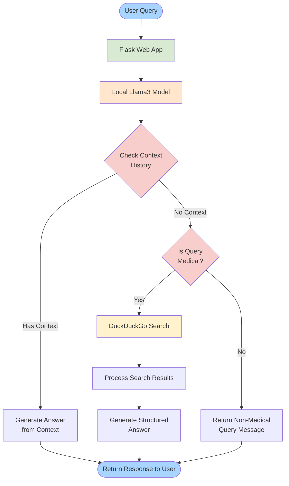

# Medical Chatbot

A locally-hosted medical chatbot powered by Llama3 through Ollama, featuring context-aware responses and medical information retrieval.

## Architecture Flow

The chatbot follows a structured flow to process and respond to user queries:

## How It Works

1. **User Interface**: Users interact with the chatbot through a Flask-based web interface.

2. **Query Processing**:
   - The query is processed by a locally running Llama3 model via Ollama
   - The system first checks the conversation history for relevant context

3. **Response Generation**:
   - If sufficient context exists, the bot generates an answer directly
   - If context is missing, the system verifies if the query is medical-related
   - Non-medical queries are rejected with an appropriate message
   - For valid medical queries without context, the system performs a DuckDuckGo search
   - Search results are processed and structured into a comprehensive response

## Features

- Local LLM hosting using Ollama
- Context-aware conversations
- Medical query validation
- Integration with DuckDuckGo for up-to-date medical information
- Web-based user interface

## Prerequisites

- Python 3.x
- Flask
- Ollama with Llama3 model
- Internet connection for DuckDuckGo searches

## Installation

[Add your installation instructions here]

## Usage

[Add your usage instructions here]

## Contributing

[Add your contribution guidelines here]

## License

[Add your license information here]
